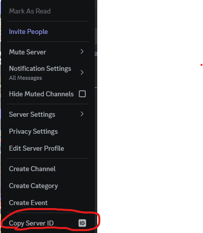
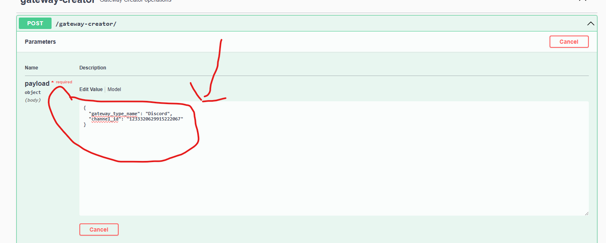
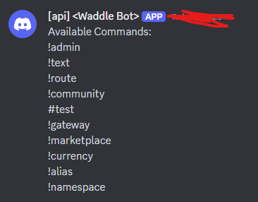
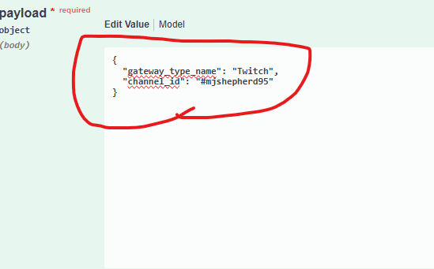
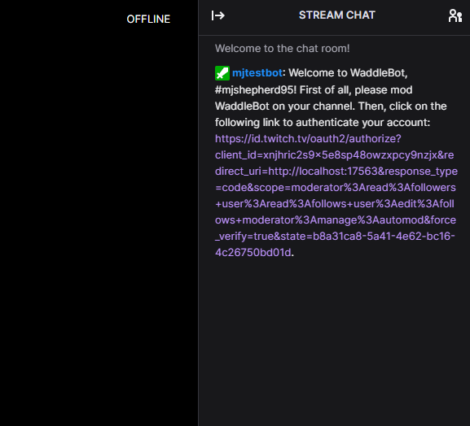

[](https://semver.org) 


# Project Overview
WaddleBot is a combination of a watcher service, core modules and serverless scripting (Lambda / OpenWhisk) which enables you to tag and direct traffic live to scripts any time anywhere! 
The bot is built on top of MatterBridge for core chat monitoring, giving access to dozens of platforms for our core modules. We also add other libraries and API queries to supplement. 

</a>

# Why this bot vs others
## Scalable and Modular
The MenialBot is able to handle a large load as the watcher service (WaddleBot Router) is only a collect and forward docker service. Simply split channels between multiple docker deployments! 
The majority of the work and slowness is in the modules. These modules are simple action scripts which are triggered based on tagging first, specifics second.

## Secured... even if the software isn't
All images under go a 8 stage security check to ensure not only is the my portion of the code secure, but to also identify and help remediate the underlying libraries and software security. 

## Updated weekly
All of our images are checked weekly for updates from upstream sources, and we have an on-staff seasoned security engineer who periodically checks our code.

## Active contribution and maintenance
PenguinzPlays has enlisted the help of his friends to ensure these images don't flop. He also uses this bot, so he doesn't want it to flop either!

## Scalable
This bot was designed to handle 1000's of channels/interfaces per cluster and keep on pressing.

## Penguinz drinks his own koolaid
Penguinz and team uses this bot first before we deploy to everyone else to identify bugs which our unit tests and automation misses.

## Beta testing
Penguinz relies on volunteer customers and community members to beta test images, ensuring our stable / production images are well baked and as bug free as possible before it goes to release candidate.

## Project Setup
To compile the project for testing/deployment, do the following:

1. Run git clone to also setup the submodules:
`git clone --recurse-submodules -b 1.1.0test https://github.com/PenguinCloud/WaddleBot-Core.git`

2. Set the branches of all the submodules as follows:

```
WaddleDBM: '1.1.0-test'
WaddlebotLibs: '1.1.0-waddledbm-test'
Waddlebot-GwMgr: 'MJ-Development'
```

To change branches, run the command `git checkout <branch name>` in the root folder of the above submodules like so:

```
In "WaddleBot-Core/modules/WaddleDBM" do "git checkout 1.1.0-test"
In "WaddleBot-Core/modules/WaddleDBM/modules/WaddlebotLibs" do "git checkout 1.1.0-waddledbm-test"
In "WaddleBot-Core/modules/Waddlebot-GwMgr" do "git checkout MJ-Development"
```

3. Navigate to the root folder of Waddlebot Core where the docker-compose.yml file is located.

4. Ensure that you have docker installed and running on your local machine.

5. Ensure you have a .env file setup with the necessary variables in the root folder where the docker-compose.yml is located. The necessary variables (fill in the values between <> characters):

```
GATEWAY_CREATION_URL="http://172.17.0.1:8000/WaddleDBM/routing_gateways/create_gateway.json"
GATEWAY_DELETION_URL="http://172.17.0.1:8000/WaddleDBM/routing_gateways/delete_by_channel_id_and_gateway_type.json/"
GATEWAY_SERVER_GET_URL="http://172.17.0.1:8000/WaddleDBM/gateway_servers/get_all.json"
GATEWAY_ACTIVATE_URL="http://172.17.0.1:8000/WaddleDBM/routing_gateways/activate_gateway.json"
GATEWAY_SERVERS_GET_URL="http://172.17.0.1:8000/WaddleDBM/gateway_servers/get_all.json"
GATEWAY_SERVER_CREATE_URL="http://172.17.0.1:8000/WaddleDBM/gateway_servers/create_gateway_server.json"
GATEWAY_SERVER_DELETE_URL="http://172.17.0.1:8000/WaddleDBM/gateway_servers/delete_by_name.json/"
TWITCH_HOST="irc.chat.twitch.tv"
TWITCH_PORT="6667"
TWITCH_PASS="<Twitch Oauth Token>"
TWITCH_NICK="WaddleBot"
TWITCH_AUTH_URL="https://id.twitch.tv/oauth2/authorize"
TWITCH_AUTH_CLIENT_ID="<Twitch APP ID>"
TWITCH_AUTH_REDIRECT_URI="http://localhost:17563"
TWITCH_AUTH_RESPONSE_TYPE="code"
TWITCH_AUTH_SCOPE="moderator%3Aread%3Afollowers+user%3Aread%3Afollows+user%3Aedit%3Afollows+moderator%3Amanage%3Aautomod"
DISCORD_TOKEN="<Discord Token>"
DISCORD_BOT_INVITE_URL="https://discordapp.com/oauth2/authorize?&client_id=1233317711967424522&scope=bot&permissions=536870912"
TWITCH_APP_ID="<Twitch APP ID>"
TWITCH_APP_SECRET="<Twitch App Secret>"
CONTEXT_URL="http://172.17.0.1:8000/WaddleDBM/context/initialize_user.json"
GATEWAYS_GET_URL="http://172.17.0.1:8000/WaddleDBM/routing_gateways/get_all.json"
EVENTSUB_URL = 'https://mj-dev.penguintech.io/'
GATEWAY_ACTIVATE_URL="http://172.17.0.1:8000/WaddleDBM/routing_gateways/activate_gateway.json"
TWITCH_TOKEN="<Twitch Oauth token>"
API_NAME="WaddleAPI"
API_ADDRESS="0.0.0.0:4000"
MATTERBRIDGE_URL='http://172.17.0.1:4200/api/'
USER_MANGER_URL='http://172.17.0.1:8000/WaddleDBM/identities/create.json/'
MARKETPLACE_URL='http://172.17.0.1:8000/marketplace_manager/marketplace/get.json'
COMMUNITY_MODULES_URL='http://172.17.0.1:8000/WaddleDBM/community_modules/get_by_community_name_and_module_id.json/'
CONTEXT_URL='http://172.17.0.1:8000/WaddleDBM/context/'
REDIS_HOST='172.17.0.1'
REDIS_PORT=6379
```

6. Run the following command:

`docker compose up`

7. In docker, a collection of containers should be setup and running now.

8. Matterbridge and the listener should be throwing errors, because no gateway is setup.

9. Go to the next section [Channel Onboarding](#channel-onboarding)

## Channel onboarding
For the core with all of its modules to function properly and interaction via commands to commence, a basic gateway needs to be configured. Its done through the following steps:

1. Complete the [Project Setup](#project-setup) section.

2. Ensure all the containers are running, except matterbridge. 

3. Navigate to http://localhost:5000/ if its running locally to open the gateway manager REST API Swagger UI.

4. Choose between a [Discord](#discord-channel-setup) setup or [Twitch](#twitch-channel-setup) setup.

## Discord Channel Setup

1. Ensure you have a discord server that you want to add.

2. Right click on the name of the server and hit "Copy Server ID":



3. On the gateway manager API, look for the green "POST" /gateway-creator/ section and expand it:


4. Hit the "Try it out" button on the right of the new expanded section:


5. Input the following JSON object in the big "payload" section:

```
{
  "gateway_type_name": "Discord",
  "channel_id": "<THE CHANNEL ID YOU COPIED EARLIER>"
}
```


6. If all went well, you should see the following output on the UI:


7. The owner of the server should also have received a message such as the following:


8. Click on the provided link to start the bot adding process.

9. Select the server in the prompt.


10. Hit "Continue" to add the bot to your server:


11. Ensure "Manage Webhooks" are selected in the next prompt and hit "Authorize":


12. The bot should now be added to your server.

13. Now, restart the matterbridge container in docker for your server to be available to waddlebot:


14. Open the container in docker and check the logs:


15. If matterbridge can communicate with the newly added discord server, you should see your server id here:


16. Congradulation! Your server is now available on waddlebot!

17. To start interacting with waddlebot, navigate to your "general" channel and type the following to test the listener's response:

`!help`

18. If you see a list of commands, your good to go!



## Twitch Channel Setup
For the core module to communicate properly with twitch, do the following:

1. Get the channel name by navigating to the channel in question and copying the channel_name in the URL:


2. On the gateway manager API, look for the green "POST" /gateway-creator/ section and expand it:


3. Hit the "Try it out" button on the right of the new expanded section:


4. Input the following JSON object in the big "payload" section:

```
{
  "gateway_type_name": "Twitch",
  "channel_id": "#<THE NAME OF THE CHANNEL WITH THE # CHARACTER AT THE FRONT>"
}
```


5. If all went well, you should see the following output on the UI:


6. The twitch channel should have now also received a message from waddlebot:



7. Click on the bot's name and make them a mod on your channel:


8. After modding the bot, click on the provided link. In the prompt that appears, click "Authorize":


9. The twitch account should now be reday to use with waddlebot!

10. Now, restart the matterbridge container in docker for the channel to be available to waddlebot:


14. Open the container in docker and check the logs. If you see the following, the channel should now be available to WaddleBot:


15. The Twitch Channel is now configured with Waddlebot!

16. To test the listener's response, type the following in the Twitch chat:

`!help`

17. If a list of commands appear, you are good to go!:


# Contributors
## Core Maintainers: 
* Penguin@PenguinTech.io
* MJ Shepherd
*JFish

## community

* Join in and become a contributor!


# Resources
Documentation: ./docs/
Premium Support: https://support.penguintech.io
Community Bugs / Issues: -/issues
