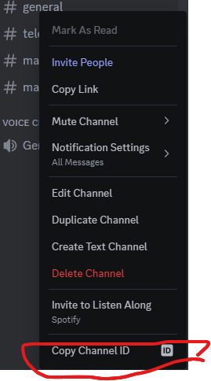
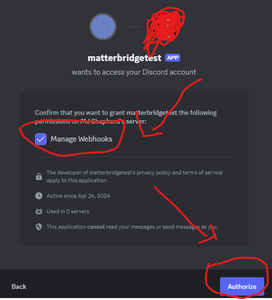
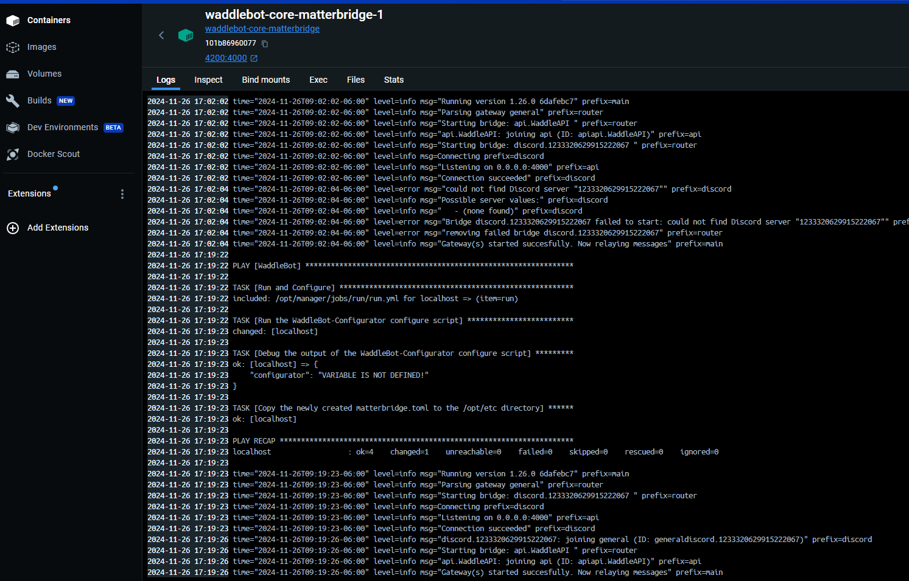
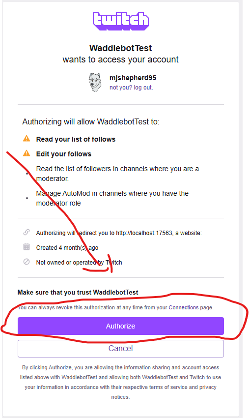

## Channel onboarding
To setup the project locally, do the following:

1. Ensure that you have a .env file available in the root directory of the project, containing the following variables:

```
GATEWAY_CREATION_URL="" (URL of the WaddleDBM endpoint to create a new gateway)
GATEWAY_DELETION_URL="" (URL of the WaddleDBM endpoint to delete a gateway)
GATEWAY_SERVER_GET_URL="" (URL of the WaddleDBM endpoint to get all existing gateway Servers)
GATEWAY_SERVER_CREATE_URL="" (URL of the WaddleDBM endpoint to create a gateway Server)
GATEWAY_SERVER_DELETE_URL="" (URL of the WaddleDBM endpoint to delete a gateway Server)

TWITCH_HOST="irc.chat.twitch.tv" (The default twitch chat server that twitch uses to interact with chat)
TWITCH_PORT="6667" (The default twitch server port for twitch chat)
TWITCH_PASS="" (Your twitch developer oauth token, retrieved from https://id.twitch.tv/oauth2/authorize)
TWITCH_NICK="Waddlebot" (The default name of waddlebot)

TWITCH_AUTH_URL="https://id.twitch.tv/oauth2/authorize" (Twitch Auth URL)
TWITCH_AUTH_CLIENT_ID="" (Your twitch app auth id)
TWITCH_AUTH_REDIRECT_URI="http://localhost:17563" (The twitch auth redirect URL. Leave like this for now)
TWITCH_AUTH_RESPONSE_TYPE="code" (Twitch Response type)
TWITCH_AUTH_SCOPE="moderator%3Aread%3Afollowers+user%3Aread%3Afollows+user%3Aedit%3Afollows+moderator%3Amanage%3Aautomod" (Twitch required scopes for bot to work)

DISCORD_TOKEN="" (Your discord bot token)
DISCORD_BOT_INVITE_URL="https://discordapp.com/oauth2/(your-bot-details-here)" (An invite URL for your bot that is retrieved from https://discord.com/developers/applications/)
```

2. Run the following in the root directory to run the module:

```
docker-compose up
```

3. Navigate to http://localhost:80/ if its running locally to open the gateway manager REST API Swagger UI.

4. Choose between a [Discord](#discord-channel-setup) setup or [Twitch](#twitch-channel-setup) setup.

## Discord Channel Setup

1. Ensure you have a discord server that you want to add.

2. Right click on the name of the server and hit "Copy Server ID":


3. Find the channel you want to add on your server. Right click it, and select "copy channel id":



4. On the gateway manager API, look for the green "POST" /gateway-creator/discord/ section and expand it:


5. Hit the "Try it out" button on the right of the new expanded section:


6. Input the following JSON object in the big "payload" section:

```
{
  "channel_id": "<THE CHANNEL ID YOU COPIED EARLIER>",
  "server_id": "<THE SERVER ID YOU COPIED EARLIER>"
}
```


7. If all went well, you should see the following output on the UI:


8. The owner of the server should also have received a message such as the following:


9. Click on the provided link to start the bot adding process.

10. Select the server in the prompt.


11. Hit "Continue" to add the bot to your server:


12. Ensure "Manage Webhooks" are selected in the next prompt and hit "Authorize":



13. The bot should now be added to your server.

14. Now, restart the matterbridge container in docker for your server to be available to waddlebot:


15. Open the container in docker and check the logs:



16. If matterbridge can communicate with the newly added discord server, you should see your server id here:


17. Congratulations! Your server is now available on waddlebot!

18. To start interacting with waddlebot, navigate to your "general" channel and type the following to test the listener's response:

`!help`

19. If you see a list of commands, your good to go!


## Twitch Channel Setup
For the core module to communicate properly with twitch, do the following:

1. Get the channel name by navigating to the channel in question and copying the channel_name in the URL:


2. On the gateway manager API, look for the green "POST" /gateway-creator/ section and expand it:


3. Hit the "Try it out" button on the right of the new expanded section:


4. Input the following JSON object in the big "payload" section:

```
{
  "gateway_type_name": "Twitch",
  "channel_id": "#<THE NAME OF THE CHANNEL WITH THE # CHARACTER AT THE FRONT>"
}
```


5. If all went well, you should see the following output on the UI:


6. The twitch channel should have now also received a message from waddlebot:


7. Click on the bot's name and make them a mod on your channel:


8. After modding the bot, click on the provided link. In the prompt that appears, click "Authorize":



9. The twitch account should now be reday to use with waddlebot!

10. Now, restart the matterbridge container in docker for the channel to be available to waddlebot:


14. Open the container in docker and check the logs. If you see the following, the channel should now be available to WaddleBot:


15. The Twitch Channel is now configured with Waddlebot!

16. To test the listener's response, type the following in the Twitch chat:

`!help`

17. If a list of commands appear, you are good to go!:

